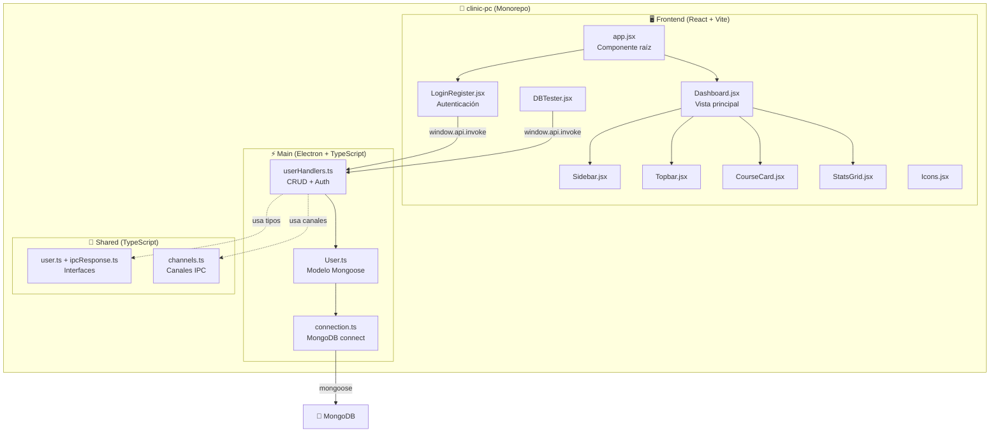

# 📁 Esquema de Carpetas — clinic-pc (EduPlatform)

> Aplicación de escritorio Electron con React + MongoDB. Arquitectura monorepo con 3 paquetes: `frontend`, `main` y `shared`.

---

## 🗂️ Árbol de Carpetas General

```
clinic-pc/
├── 📄 .env.example                  ─ Variables de entorno de ejemplo
├── 📄 .eslintrc.cjs                 ─ Configuración de ESLint
├── 📄 .gitignore                    ─ Archivos ignorados por Git
├── 📄 .prettierrc                   ─ Configuración de Prettier (formateo de código)
├── 📄 package.json                  ─ Configuración raíz del monorepo
├── 📄 package-lock.json             ─ Lockfile de dependencias
├── 📄 README.md                     ─ Documentación del proyecto
├── 📄 SECURITY.md                   ─ Política de seguridad
│
├── 📂 docs/                         ─ Documentación del equipo
│   ├── 📄 AUTH_GUIDE.md             ─ Guía de autenticación
│   ├── 📄 ESTRUCTURA_PROYECTO.md    ─ Estructura del proyecto
│   ├── 📄 GUIA_CODIGO.md            ─ Guía de estilo de código
│   ├── 📄 IMPLEMENTACION_LOGIN_REGISTER.md ─ Implementación de login/register
│   ├── 📄 REGLAS_COLABORACION.md    ─ Reglas de colaboración del equipo
│   ├── 📄 SETUP_INICIAL.md          ─ Guía de setup inicial
│   └── 📂 EduPlatform/              ─ Recursos adicionales de EduPlatform
│
├── 📂 .github/                      ─ Configuración de GitHub (CI, templates)
│
└── 📂 packages/                     ─ Monorepo con 3 paquetes
    ├── 📂 frontend/                 ─ 🖥️ Interfaz de usuario (React + Vite)
    ├── 📂 main/                     ─ ⚡ Proceso principal (Electron + MongoDB)
    └── 📂 shared/                   ─ 🤝 Tipos e interfaces compartidas (TypeScript)
```

---

## 📦 Paquete: `packages/frontend/` — Interfaz de Usuario

> **Tecnologías:** React 18, Vite, React Router DOM  
> **Propósito:** Renderiza toda la UI de la aplicación (renderer process de Electron)

```
packages/frontend/
├── 📄 index.html                    ─ Punto de entrada HTML para Vite/Electron
├── 📄 package.json                  ─ Dependencias del frontend
├── 📄 vite.config.js                ─ Configuración de Vite (puerto 5173, plugin React)
│
└── 📂 src/
    ├── 📄 app.jsx                   ─ 🏠 Componente raíz de la aplicación
    │
    ├── 📂 components/               ─ Componentes reutilizables de UI
    │   ├── 📄 Dashboard.jsx         ─ Dashboard principal (autónomo con sidebar, topbar, stats y cursos)
    │   ├── 📄 LoginRegister.jsx     ─ Formularios de Login y Registro con validación IPC
    │   ├── 📄 Sidebar.jsx           ─ Barra lateral de navegación (reutilizable)
    │   ├── 📄 Topbar.jsx            ─ Barra superior con saludo, notificaciones y avatar
    │   ├── 📄 CourseCard.jsx        ─ Tarjeta individual de curso (rating, progreso, alumnos)
    │   ├── 📄 StatGrid.jsx         ─ Grid de estadísticas (estudiantes, cursos, lecciones, completación)
    │   ├── 📄 Checklist.jsx         ─ Lista de verificación del setup tecnológico
    │   ├── 📄 Techstack.jsx         ─ Muestra pills del stack tecnológico usado
    │   ├── 📄 DBTester.jsx          ─ Panel de pruebas de conexión IPC → MongoDB
    │   │
    │   └── 📂 icons/
    │       └── 📄 Icons.jsx         ─ Biblioteca de iconos SVG reutilizables
    │
    ├── 📂 features/                 ─ Módulos por funcionalidad
    │   └── 📂 dashboard/
    │       └── 📄 dashboard.jsx     ─ Versión modularizada del Dashboard (usa Sidebar, Topbar, StatsGrid, CourseCard)
    │
    └── 📂 style/                    ─ Estilos CSS
        ├── 📄 styles.css            ─ Archivo principal de importación de estilos
        └── 📂 styles/
            ├── 📄 index.css         ─ Variables CSS globales, reset y tipografía base
            ├── 📄 app.css           ─ Estilos del layout principal (sidebar, app-layout, cards dev)
            ├── 📄 Dashboard.css     ─ Estilos del Dashboard (sidebar, topbar, stats, course cards)
            └── 📄 auth.css          ─ Estilos de los formularios de Login/Register
```

---

### 📋 Detalle de Cada Archivo del Frontend

#### [app.jsx](file:///c:/Users/SSP_LAB/Downloads/clinic-pc/packages/frontend/src/app.jsx)
| Aspecto | Detalle |
|---------|---------|
| **Función** | Componente raíz que controla la navegación y renderiza la vista activa |
| **Estado** | `dbStatus`, `result`, `activeNav`, `isElectron` |
| **Navegación** | Dashboard, Usuarios/Auth, Cursos, Calificaciones, Configuración |
| **Renderiza** | `<Dashboard>` cuando `activeNav === 'dashboard'`, `<LoginRegister>` para `'users'`, panel dev por defecto |

#### [Dashboard.jsx](file:///c:/Users/SSP_LAB/Downloads/clinic-pc/packages/frontend/src/components/Dashboard.jsx)
| Aspecto | Detalle |
|---------|---------|
| **Función** | Dashboard completo y autónomo con sidebar, topbar, estadísticas y tarjetas de cursos |
| **Datos mock** | `MOCK_USER`, `NAV_ITEMS`, `STATS` (4 métricas), `COURSES` (6 cursos) |
| **Iconos** | Define iconos SVG localmente (GraduationCap, Grid, Users, Book, BarChart, etc.) |
| **Responsive** | Sidebar colapsable con overlay para móvil |

#### [LoginRegister.jsx](file:///c:/Users/SSP_LAB/Downloads/clinic-pc/packages/frontend/src/components/LoginRegister.jsx)
| Aspecto | Detalle |
|---------|---------|
| **Función** | Sistema completo de autenticación (login + registro) |
| **IPC Channels** | `auth:login`, `auth:register`, `auth:logout` |
| **Validación** | Client-side antes de enviar al proceso principal |
| **Roles** | `student`, `teacher`, `admin` |
| **Estados** | Muestra dashboard de usuario autenticado o formularios |

#### [Sidebar.jsx](file:///c:/Users/SSP_LAB/Downloads/clinic-pc/packages/frontend/src/components/Sidebar.jsx)
| Aspecto | Detalle |
|---------|---------|
| **Función** | Barra lateral de navegación reutilizable con marca EduPlatform |
| **Props** | `activeNav`, `sidebarOpen`, `setSidebarOpen`, `handleNav` |
| **Secciones** | Brand, navegación (5 items), footer con logout |

#### [Topbar.jsx](file:///c:/Users/SSP_LAB/Downloads/clinic-pc/packages/frontend/src/components/Topbar.jsx)
| Aspecto | Detalle |
|---------|---------|
| **Función** | Barra superior con saludo dinámico (mañana/tarde/noche), notificaciones y avatar |
| **Props** | `user`, `setSidebarOpen` |

#### [CourseCard.jsx](file:///c:/Users/SSP_LAB/Downloads/clinic-pc/packages/frontend/src/components/CourseCard.jsx)
| Aspecto | Detalle |
|---------|---------|
| **Función** | Tarjeta de curso individual con thumbnail gradient, rating, duración, alumnos y barra de progreso |
| **Props** | `course`, `index` |
| **Estados del curso** | `active` (Activo), `review` (En revisión), `draft` (Borrador) |

#### [StatsGrid.jsx](file:///c:/Users/SSP_LAB/Downloads/clinic-pc/packages/frontend/src/components/StatsGrid.jsx)
| Aspecto | Detalle |
|---------|---------|
| **Función** | Grilla de 4 tarjetas de estadísticas con animación escalonada |
| **Métricas** | Estudiantes activos, cursos publicados, lecciones totales, tasa de completación |

#### [DBTester.jsx](file:///c:/Users/SSP_LAB/Downloads/clinic-pc/packages/frontend/src/components/DBTester.jsx)
| Aspecto | Detalle |
|---------|---------|
| **Función** | Panel de pruebas para verificar conexión IPC → MongoDB |
| **Acciones** | GET todos los usuarios, crear usuario de prueba, limpiar resultados |
| **IPC Channels** | `user:get-all`, `user:create` |

#### [Checklist.jsx](file:///c:/Users/SSP_LAB/Downloads/clinic-pc/packages/frontend/src/components/Checklist.jsx)
| Aspecto | Detalle |
|---------|---------|
| **Función** | Muestra lista de verificación del setup tecnológico (React, Electron, Mongoose, etc.) |

#### [Techstack.jsx](file:///c:/Users/SSP_LAB/Downloads/clinic-pc/packages/frontend/src/components/Techstack.jsx)
| Aspecto | Detalle |
|---------|---------|
| **Función** | Muestra pills/badges con las tecnologías del stack (React, Vite, Electron, MongoDB, JS) |

#### [Icons.jsx](file:///c:/Users/SSP_LAB/Downloads/clinic-pc/packages/frontend/src/components/icons/Icons.jsx)
| Aspecto | Detalle |
|---------|---------|
| **Función** | Biblioteca centralizada de 12 iconos SVG exportados como componentes React |
| **Iconos** | `IconGraduationCap`, `IconGrid`, `IconUsers`, `IconBook`, `IconBarChart`, `IconSettings`, `IconBell`, `IconLogOut`, `IconPlus`, `IconMenu`, `IconClose`, `IconStar`, `IconClock` |

#### [dashboard.jsx](file:///c:/Users/SSP_LAB/Downloads/clinic-pc/packages/frontend/src/features/dashboard/dashboard.jsx) (feature)
| Aspecto | Detalle |
|---------|---------|
| **Función** | Versión modularizada del Dashboard que usa componentes separados (Sidebar, Topbar, StatsGrid, CourseCard) |
| **Diferencia** | A diferencia de `components/Dashboard.jsx`, este delega en componentes reutilizables |

---

## ⚡ Paquete: `packages/main/` — Proceso Principal (Electron)

> **Tecnologías:** Electron, TypeScript, Mongoose, bcryptjs  
> **Propósito:** Proceso principal de Electron. Gestiona la ventana, base de datos y handlers IPC.

```
packages/main/
├── 📄 package.json                  ─ Dependencias del proceso principal
│
└── 📂 src/
    ├── 📂 db/                       ─ Capa de base de datos
    │   ├── 📄 connection.ts         ─ Conexión y desconexión a MongoDB
    │   └── 📂 models/
    │       └── 📄 User.ts           ─ Modelo Mongoose de Usuario
    │
    └── 📂 ipc/                      ─ Handlers de comunicación IPC
        └── 📄 userHandlers.ts       ─ Handlers CRUD + Auth para usuarios
```

---

### 📋 Detalle de Cada Archivo del Main

#### [connection.ts](file:///c:/Users/SSP_LAB/Downloads/clinic-pc/packages/main/src/db/connection.ts)
| Aspecto | Detalle |
|---------|---------|
| **Función** | Conectar y desconectar de MongoDB |
| **Exports** | `connectDB()`, `disconnectDB()` |
| **URI default** | `mongodb://localhost:27017/clinic-pc` |

#### [User.ts](file:///c:/Users/SSP_LAB/Downloads/clinic-pc/packages/main/src/db/models/User.ts)
| Aspecto | Detalle |
|---------|---------|
| **Función** | Schema y modelo Mongoose para usuarios con autenticación |
| **Campos** | `name`, `email` (unique), `password` (hashed, select:false), `role` |
| **Roles** | `admin`, `teacher`, `student` (default) |
| **Seguridad** | Hash con `bcryptjs` (salt 10) en pre-save hook |
| **Métodos** | `comparePassword(plain)` — compara contraseña plana con hash |
| **Exports** | `IUser` (interface), `User` (modelo) |

#### [userHandlers.ts](file:///c:/Users/SSP_LAB/Downloads/clinic-pc/packages/main/src/ipc/userHandlers.ts)
| Aspecto | Detalle |
|---------|---------|
| **Función** | Registra todos los handlers IPC para operaciones de usuario |
| **Canales Auth** | `auth:register` (validaciones + crear usuario), `auth:login` (verificar credenciales), `auth:logout` |
| **Canales CRUD** | `user:get-all`, `user:get-by-id`, `user:create`, `user:update`, `user:delete` |
| **Respuesta** | `{ success: true, data }` o `{ success: false, error }` |

---

## 🤝 Paquete: `packages/shared/` — Tipos Compartidos

> **Tecnologías:** TypeScript  
> **Propósito:** Interfaces, tipos y constantes compartidos entre `main` y `frontend`

```
packages/shared/
├── 📄 package.json                  ─ Nombre: @eduplatform/shared
├── 📄 tsconfig.json                 ─ Configuración TypeScript
│
└── 📂 src/
    ├── 📄 index.ts                  ─ Barrel export (re-exporta todo)
    │
    ├── 📂 types/
    │   ├── 📄 user.ts               ─ Interfaces de usuario y DTOs de auth
    │   └── 📄 ipcResponse.ts        ─ Wrapper genérico de respuestas IPC
    │
    └── 📂 ipc/
        └── 📄 channels.ts           ─ Constantes de canales IPC
```

---

### 📋 Detalle de Cada Archivo del Shared

#### [index.ts](file:///c:/Users/SSP_LAB/Downloads/clinic-pc/packages/shared/src/index.ts)
| Aspecto | Detalle |
|---------|---------|
| **Función** | Barrel export — punto de entrada único que re-exporta `types/user`, `types/ipcResponse`, `ipc/channels` |

#### [user.ts](file:///c:/Users/SSP_LAB/Downloads/clinic-pc/packages/shared/src/types/user.ts)
| Aspecto | Detalle |
|---------|---------|
| **Exports** | `IUser`, `CreateUserDTO`, `UpdateUserDTO`, `RegisterDTO`, `LoginDTO`, `AuthResponse`, `ErrorResponse` |
| **IUser** | `_id?`, `name`, `email`, `password?`, `role`, `createdAt?`, `updatedAt?` |

#### [ipcResponse.ts](file:///c:/Users/SSP_LAB/Downloads/clinic-pc/packages/shared/src/types/ipcResponse.ts)
| Aspecto | Detalle |
|---------|---------|
| **Función** | Tipo genérico para envolver respuestas IPC con `success`, `data?`, `error?` |
| **Exports** | `IpcResponse<T>`, `ipcSuccess(data)`, `ipcError(error)` |

#### [channels.ts](file:///c:/Users/SSP_LAB/Downloads/clinic-pc/packages/shared/src/ipc/channels.ts)
| Aspecto | Detalle |
|---------|---------|
| **Función** | Define los nombres de todos los canales IPC como constantes tipadas |
| **Canales** | `AUTH_REGISTER`, `AUTH_LOGIN`, `AUTH_LOGOUT`, `AUTH_GET_CURRENT`, `USER_GET_ALL`, `USER_GET_BY_ID`, `USER_CREATE`, `USER_UPDATE`, `USER_DELETE`, `DB_STATUS` |
| **Exports** | `IPC_CHANNELS` (objeto const), `IpcChannel` (tipo union) |

---

## 📚 Librerías y Dependencias

### Dependencias de Producción (raíz)

| Librería | Versión | Propósito |
|----------|---------|-----------|
| `react` | ^18.2.0 | Biblioteca UI para construir interfaces de usuario |
| `react-dom` | ^18.2.0 | Renderizador DOM de React |
| `react-router-dom` | ^6.22.0 | Enrutamiento SPA para React |
| `mongoose` | ^8.0.0 | ODM para MongoDB (schemas, modelos, queries) |
| `dotenv` | ^16.4.5 | Carga variables de entorno desde `.env` |

### Dependencias de Desarrollo (raíz)

| Librería | Versión | Propósito |
|----------|---------|-----------|
| `electron` | ^39.8.5 | Framework para apps de escritorio con tecnologías web |
| `electron-builder` | ^26.15.2 | Empaquetador de apps Electron para distribución |
| `vite` | ^8.0.16 | Bundler ultrarrápido para desarrollo y producción |
| `@vitejs/plugin-react` | ^6.0.2 | Plugin de Vite para soporte de React (JSX, Fast Refresh) |
| `concurrently` | ^8.0.0 | Ejecuta múltiples scripts npm en paralelo |
| `cross-env` | ^7.0.0 | Variables de entorno cross-platform (Windows/Mac/Linux) |
| `wait-on` | ^7.0.0 | Espera a que un recurso (puerto, URL) esté disponible |
| `eslint` | ^10.5.0 | Linter de JavaScript para detectar errores y estilo |
| `prettier` | ^3.0.0 | Formateador automático de código |
| `vitest` | ^4.1.8 | Framework de testing compatible con Vite |
| `ts-node` | ^10.0.0 | Ejecuta TypeScript directamente sin compilar |
| `@types/node` | ^20.0.0 | Tipos TypeScript para Node.js |

### Dependencias del Main (Electron)

| Librería | Versión | Propósito |
|----------|---------|-----------|
| `bcryptjs` | ^2.4.3 | Hashing de contraseñas (bcrypt en JS puro) |
| `mongoose` | ^8.0.0 | ODM para MongoDB |
| `dotenv` | ^16.4.5 | Carga variables de entorno |
| `@types/bcryptjs` | ^2.4.6 | Tipos TypeScript para bcryptjs |

---

## 🔗 Diagrama de Arquitectura



---

## 🔧 Variables de Entorno (.env.example)

| Variable | Valor por defecto | Descripción |
|----------|------------------|-------------|
| `MONGODB_URI` | `mongodb://localhost:27017/clinic-pc` | URI de conexión a MongoDB local |
| `MONGODB_ATLAS_URI` | _(vacío)_ | URI de MongoDB Atlas (nube) |
| `VITE_API_URL` | `http://localhost:3000` | URL base de la API |
| `ELECTRON_SERVE` | `true` | Habilita modo serve en Electron |
| `NODE_ENV` | `development` | Entorno de ejecución |

---

## 🚀 Scripts Disponibles

| Script | Comando | Descripción |
|--------|---------|-------------|
| `dev` | `npm run dev` | Inicia frontend (Vite) + Electron en paralelo |
| `dev:frontend` | `npm run dev:frontend` | Solo el frontend con Vite en puerto 5173 |
| `dev:main` | `npm run dev:main` | Compila TS y lanza Electron en modo dev |
| `build` | `npm run build` | Compila TypeScript del main + build de Vite |
| `electron` | `npm run electron` | Lanza Electron en modo producción |
| `electron:dev` | `npm run electron:dev` | Build + dev con Electron y Vite juntos |
| `lint` | `npm run lint` | Ejecuta ESLint en todos los paquetes |
| `format` | `npm run format` | Formatea código con Prettier |
| `test` | `npm run test` | Ejecuta tests con Vitest |
